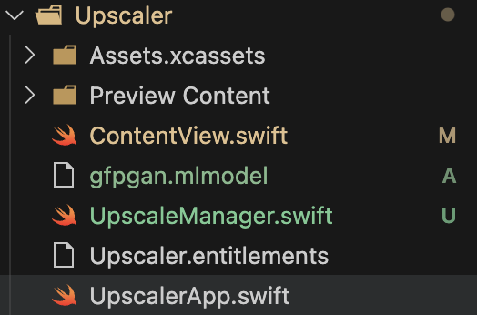
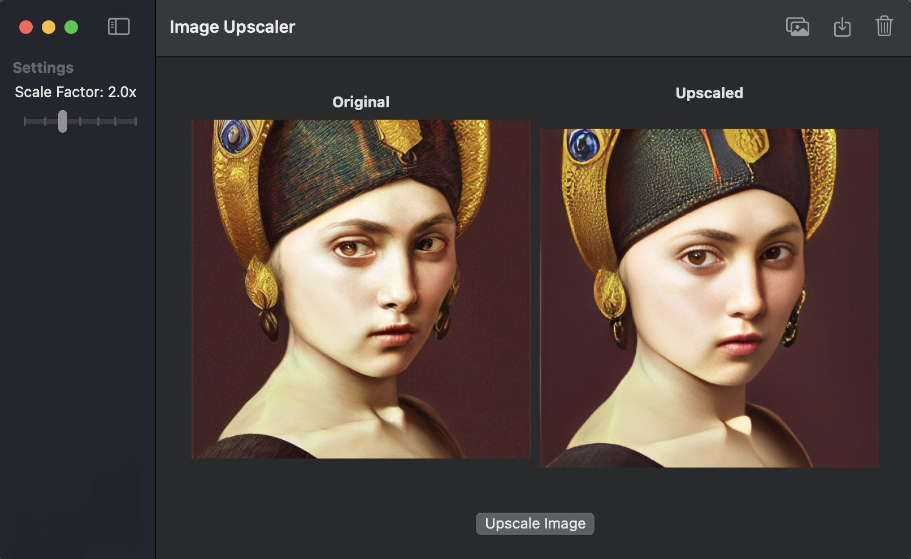

# GFPGAN Image Upscaler Mac App

Proof of concept to use the CoreML GFPGAN model to upscale images locally in a Mac App

# Download CoreML weights

First download the [gfpgan weights](https://drive.google.com/file/d/1-3fF4aPnh8ygUOmKItIrZ318xI9JGmQx/view?usp=sharing) locally in the same folder as ContentView

# Build and Run the Mac App

You should see something like this:

